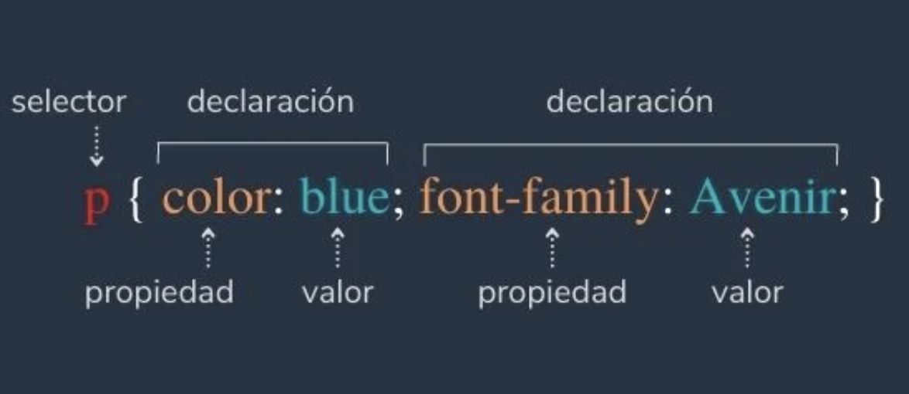

# Para enlazar el archivo .css con el documento html se usa:

<link rel="stylesheet" href="./style.css"/>

# Selectores

Todas las reglas CSS comienzan con un selector. Este indica la parte del documento donde se aplica la regla. Y al selector le siguen una o más declaraciones dentro de corchetes.

- Para señalar los elementos por su clase o atributo. La clase de selector está escrito como un punto (.) seguido del nombre de la clase. La identidad del selector se escribe con una almohadilla (#), seguida del nombre de identidad.

- Para dirigirte a un elemento «hijo» dentro de un elemento «padre», escribe el selector como si fuera el elemento padre, seguido del elemento hijo (con un espacio entre ellos).

- Si deseas asignar la misma regla a múltiples elementos, puedes hacerlo con el selector en grupo. Este abarca dos o más nombres de elementos separados por comas. El orden no es importante, pues la regla se aplicará a todos los elementos que se enumeren.
 
# Propiedad CSS

Como la primera parte de una declaración, una propiedad CSS le indica al navegador cuál característica de estilo del elemento debe cambiarse. Existen muchas propiedades CSS que afectan diferentes cosas: color, tamaño, fuente, forma o locación en una página. Una propiedad se acompaña de al menos un valor y estos elementos siempre aparecen separados por dos puntos (:).

No todas las propiedades son compatibles con todos los navegadores; no obstante, algunas son bastante amigables, como color y ancho. 

# Valor CSS

Cada propiedad tiene un paquete de valores, los cuales especifican el estilo de la propiedad. Estas son algunas propiedades usuales y sus valores: 

- Las propiedades de color pueden tener valores tan simples como una palabra (red o blue para rojo y azul, por ejemplo), códigos hexadecimales como #33E0FF o valores RGB como rgb (51, 224, 255). 

- La propiedad de ancho (width) puede tener un valor de longitud, como píxeles, o un porcentaje, que le da tamaño al elemento, según la dimensión del contenedor padre. 

- La propiedad para la familia de fuente (family font) acepta los nombres por escrito de tipografías amigables con web como Arial, Times New Roman o Courier. 